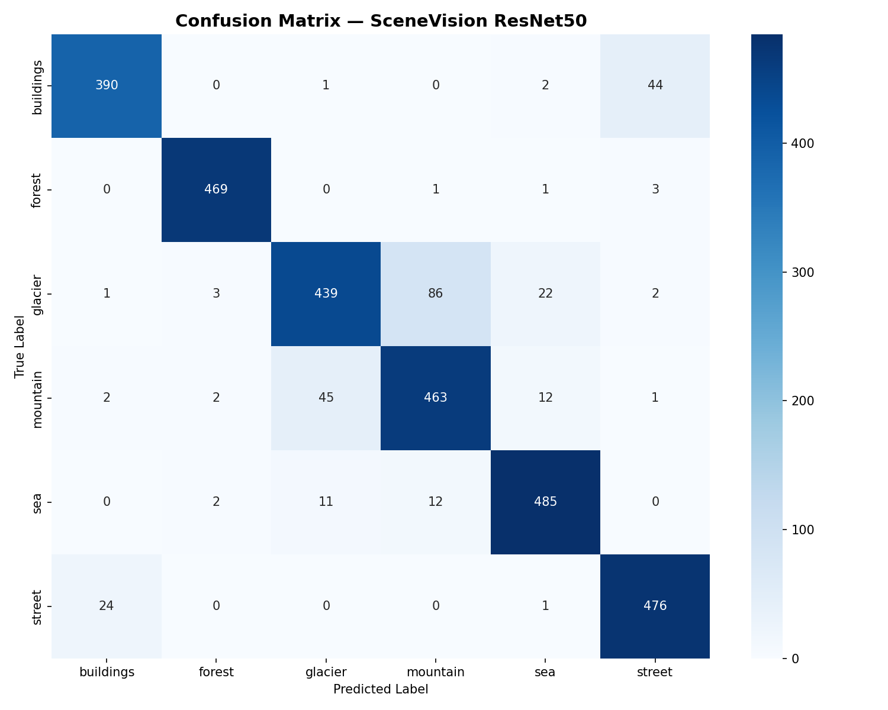

# 🌍 SceneVision — Scene Classifier

A web application that classifies natural scenes using ResNet50 trained on the Intel Image Classification Dataset.

## 🌐 Live Demo
👉 [Try it here](https://2d2187957a607d9ce6.gradio.live)

## 🎯 Results
- **Accuracy**: 91% on 3,000 test images
- **Classes**: Buildings, Forest, Glacier, Mountain, Sea, Street
- **Model**: ResNet50 (Transfer Learning)

## 🛠️ Tech Stack
- PyTorch + TorchVision
- Gradio (Web Interface)
- Intel Image Classification Dataset (Kaggle)

## 🚀 Run Locally
pip install -r requirements.txt
python app_gradio.py

## 📊 Dataset
[Intel Image Classification - Kaggle](https://www.kaggle.com/datasets/puneet6060/intel-image-classification)

## 📈 Confusion Matrix

